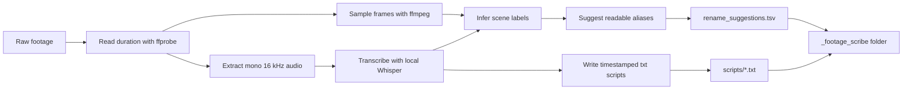
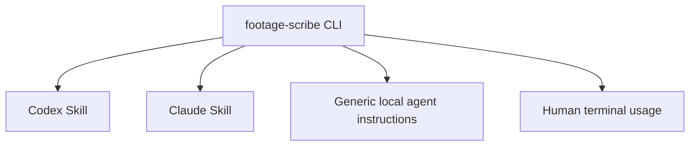
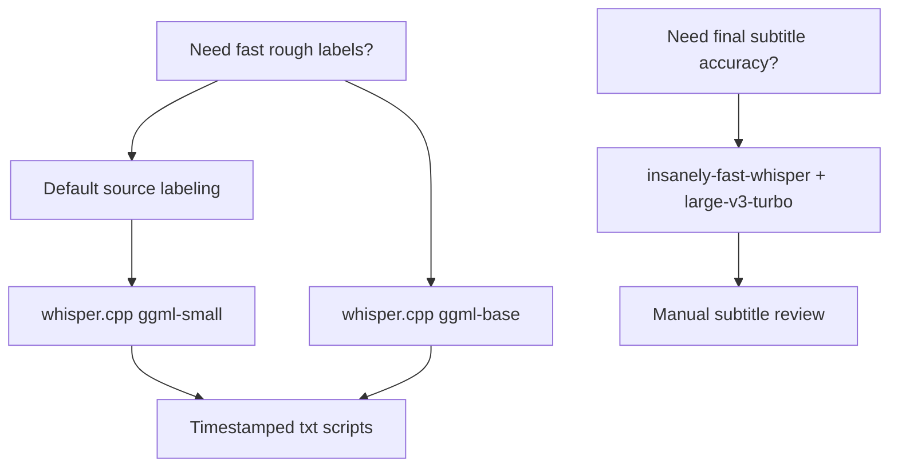
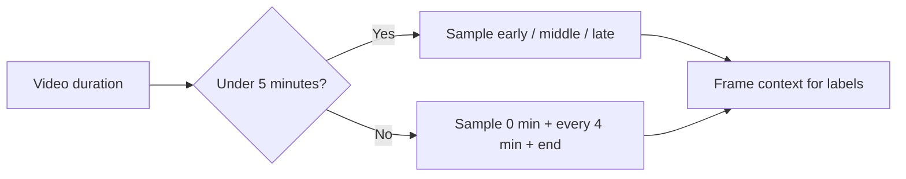
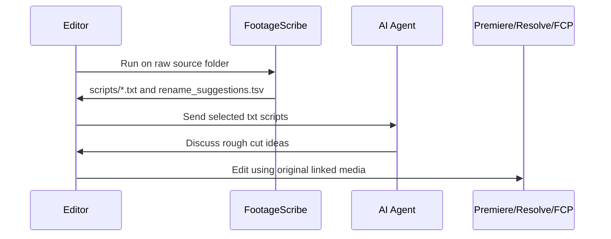

# FootageScribe

**Label raw footage. Generate timestamped transcripts. Discuss edits with your AI agent.**

FootageScribe is an agent-friendly CLI for creators and video editors. It scans raw video files, samples representative frames, transcribes speech with local Whisper models, and writes plain-text sidecar scripts plus rename suggestions.

It is designed for editing workflows where source files may already be linked in **Adobe Premiere Pro**, **DaVinci Resolve**, **Final Cut Pro**, or another NLE. FootageScribe does **not** rename or move original media. It makes footage searchable and discussable without breaking project links.

## What It Does

- Labels raw footage without modifying original files
- Generates timestamped `.txt` transcripts for each video
- Suggests human-readable filenames without applying renames
- Samples frames to infer visual context
- Builds simple TSV manifests for search and review
- Creates agent-ready editing notes for ChatGPT, Claude, Codex, Cursor, Continue, aider, and local AI agents

Typical use cases:

- raw footage labeling
- vlog file organization
- YouTube video source prep
- Premiere Pro media organization
- local Whisper transcription for video editing
- LLM-ready transcript files for rough-cut planning

## Why Sidecar Files?

Renaming source files after importing them into an editing project can break media links. FootageScribe keeps originals untouched and writes metadata beside them:

```text
VID_0017.MP4                       # original file remains unchanged
_footage_scribe/scripts/001_...txt # agent-ready transcript and labels
_footage_scribe/rename_suggestions.tsv
```

You get readable names and searchable transcripts without touching the media.

## Workflow



## Output

```text
_footage_scribe/
├── manifest.tsv
├── rename_suggestions.tsv
├── frames/
├── audio/
└── scripts/
    ├── 001_intro_room_cleanup_decision.txt
    ├── 002_bed_frame_pickup_commentary.txt
    └── 003_late_night_moving_broll.txt
```

## Example Sidecar Script

```text
Original file: VID_0017.MP4
Suggested name: intro_room_cleanup_decision.mp4
Duration: 00:02:14
Transcription model: whisper.cpp ggml-small
Original modified: no
Scene label: talking head / messy room / setup
Confidence: medium

Summary:
A talking-head clip where the creator explains that the room has become difficult to live in and introduces the plan to clean, move the bed, and reorganize the space.

Transcript:
[00:00.000 - 00:04.820] I have been putting this off for way too long.
[00:04.820 - 00:09.500] This room is basically telling me to get my life together.
[00:09.500 - 00:15.240] Today I am going to move the bed and actually clean this corner.
```

## Agent-Friendly by Design

FootageScribe is a CLI first. Skills and agent wrappers are thin instructions around the same tool:



This keeps the core workflow portable. Any agent that can read files and run shell commands can use FootageScribe.

## Model Strategy



| Goal | Model | Best for |
|---|---|---|
| Fast rough labeling | `ggml-base.bin` | Large folders, quick topic detection |
| Default source labeling | `ggml-small.bin` | Practical speed and quality |
| Final subtitle testing | `openai/whisper-large-v3-turbo` | Higher accuracy on selected final edits |

For most source organization tasks, `ggml-small.bin` is the recommended default. Larger models can improve transcription, but they are slower and still need human review.

## Requirements

- Python 3.10+
- `ffmpeg` and `ffprobe`
- `whisper.cpp`
- a local GGML Whisper model

macOS setup with Homebrew:

```bash
brew install ffmpeg whisper-cpp
mkdir -p ~/.local/share/whisper.cpp/models
curl -L -o ~/.local/share/whisper.cpp/models/ggml-small.bin \
  https://huggingface.co/ggerganov/whisper.cpp/resolve/main/ggml-small.bin
```

Optional high-accuracy experiment:

```bash
python3 -m venv /private/tmp/ifw-venv
/private/tmp/ifw-venv/bin/pip install insanely-fast-whisper
```

If Hugging Face downloads stall:

```bash
export HF_HUB_DISABLE_XET=1
```

## Usage

From a folder containing raw video files:

```bash
python3 -m footage_scribe.cli --root . --model small
```

For a known language, pass the Whisper language code:

```bash
python3 -m footage_scribe.cli --root . --model small --language ko
```

After installing as a package:

```bash
footage-scribe --root . --model small
```

Test on the first three clips:

```bash
footage-scribe --root . --output _footage_scribe_test --limit 3
```

Process matching filenames:

```bash
footage-scribe --root . --include 'intro|commentary|pickup' --model small
```

Visual-only mode:

```bash
footage-scribe --root . --mode visual-only
```

## Frame Sampling Rules



Frame sampling is useful for labels like talking head, room cleanup, desk setup, walking outside, pickup, food close-up, and B-roll. It cannot reliably infer what was said. Use audio transcription for spoken context.

## What It Does Not Do

- It does not rename original videos.
- It does not move original videos.
- It does not generate a full edit plan.
- It does not replace manual transcript review.
- It does not create final subtitles by default.

The intended pipeline:



## Related Creator Workflow

FootageScribe was created while building [Olwaty](https://olwaty.com), a content binge-watching and rediscovery platform for creators. Olwaty helps viewers continue watching a creator's archive instead of dropping off after a single video.

Both projects come from the same belief: creator content should be easier to navigate, whether you are editing raw footage or helping viewers continue watching published videos.

## Repository Layout

```text
footage-scribe/
├── README.md
├── LICENSE
├── pyproject.toml
├── footage_scribe/
│   └── cli.py
├── scripts/
│   └── prep_vlog_sources.py
├── skills/
│   ├── codex/
│   ├── claude/
│   └── generic-agent/
└── docs/
```

## Status

Early workflow tool. Tested on Apple Silicon with `ffmpeg`, `whisper.cpp`, `ggml-small.bin`, and `insanely-fast-whisper` with `openai/whisper-large-v3-turbo`.

Transcript quality depends on audio quality, background noise, language, and model choice. Always review before using transcripts as published subtitles.
