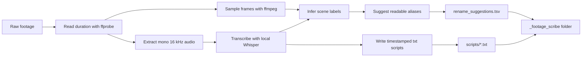
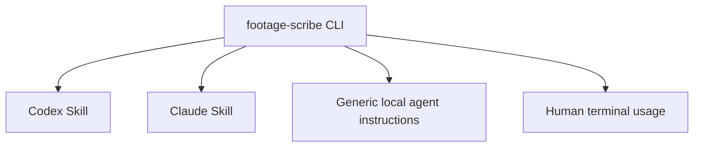
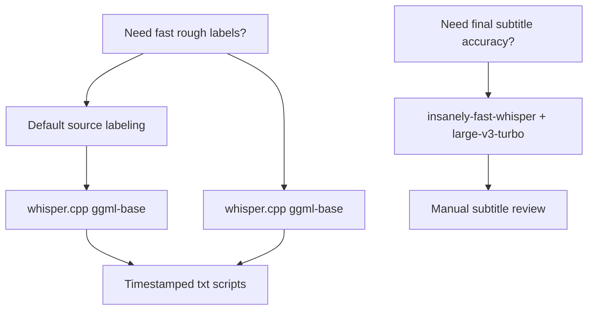
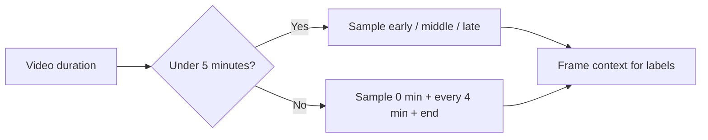
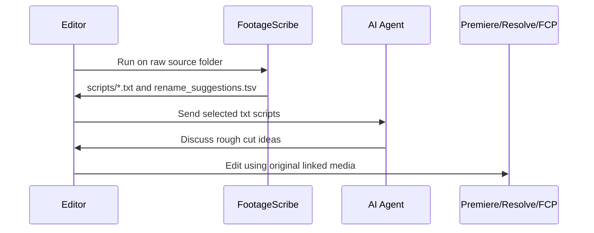

# FootageScribe

**Label raw footage. Generate timestamped transcripts. Discuss edits with your AI agent.**

FootageScribe is an agent-friendly CLI for creators and video editors. It scans raw video files, samples representative frames, transcribes speech with local Whisper models, and writes plain-text sidecar scripts plus rename suggestions. It can also rename source files when you explicitly opt in.

It is designed for editing workflows where source files may already be linked in **Adobe Premiere Pro**, **DaVinci Resolve**, **Final Cut Pro**, or another NLE. FootageScribe does **not** rename original media by default. Use `--apply-renames` only when source files are safe to rename.

New to Git or local agent setup? See [Beginner Setup](docs/BEGINNER_SETUP.md).

## What It Does

- Labels raw footage without modifying original files by default
- Generates timestamped `.txt` transcripts for each video
- Suggests human-readable filenames
- Optionally renames original source files with `--apply-renames`
- Samples frames to infer visual context
- Builds simple TSV manifests for search and review
- Creates agent-ready editing notes for ChatGPT, Claude, Codex, Cursor, Continue, aider, and local AI agents

Typical use cases:

- raw footage labeling
- vlog file organization
- YouTube video source prep
- Premiere Pro media organization
- local Whisper transcription for video editing
- LLM-ready transcript files for rough-cut planning

## Why Sidecar Files?

Renaming source files after importing them into an editing project can break media links. By default, FootageScribe keeps originals untouched and writes metadata beside them:

```text
VID_0017.MP4                       # original file remains unchanged
_footage_scribe/scripts/001_...txt # agent-ready transcript and labels
_footage_scribe/rename_suggestions.tsv
```

You get readable names and searchable transcripts without touching the media. If you are preparing fresh raw footage before importing it into an editor, add `--apply-renames` to rename the original files.

## Workflow



## Output

```text
_footage_scribe/
├── manifest.tsv
├── rename_suggestions.tsv
├── frames/
├── audio/
└── scripts/
    ├── 001_market_arrival_walkthrough.txt
    ├── 002_vendor_interview_coffee_notes.txt
    └── 003_product_closeup_broll.txt
```

## Example Sidecar Script

```text
Original file: GX010143.MP4
Suggested name: vendor_interview_coffee_notes.mp4
Final file: GX010143.MP4
Duration: 00:03:42
Transcription model: whisper.cpp ggml-small
Original modified: no
Scene label: interview / market stall / product tasting
Confidence: medium

Summary:
A short vendor conversation about how the coffee beans are roasted, followed by a handheld close-up of the tasting table.

Transcript:
[00:00.000 - 00:05.280] We roast these beans a little lighter so the citrus notes stay clear.
[00:05.280 - 00:12.640] The first sip is brighter, but the finish is more chocolate than fruit.
[00:12.640 - 00:18.900] Let me get a close shot of the label and the pour-over setup.
```

## Agent-Friendly by Design

FootageScribe is a CLI first. Skills and agent wrappers are thin instructions around the same tool:



This keeps the core workflow portable. Any agent that can read files and run shell commands can use FootageScribe.

## Model Strategy



| Goal | Model | Best for |
|---|---|---|
| Fast rough labeling | `ggml-base.bin` | Large folders, quick topic detection |
| Default source labeling | `ggml-base.bin` | Lightweight first-run default |
| Higher-quality source labeling | `ggml-small.bin` | Better transcripts when speed is less important |
| Final subtitle testing | `openai/whisper-large-v3-turbo` | Higher accuracy on selected final edits |

For most source organization tasks, `ggml-base.bin` is the default because it keeps the first run fast and the initial download small. Use `--model small` when transcript quality matters more than speed.

## Requirements

- Python 3.10+
- `ffmpeg` and `ffprobe`
- `whisper.cpp`

macOS setup with Homebrew:

```bash
brew install ffmpeg whisper-cpp
```

When transcription runs, FootageScribe automatically downloads the requested `whisper.cpp` GGML model if it is missing. Models are stored under `~/.local/share/whisper.cpp/models/`.

On Apple Silicon, FootageScribe lets `whisper.cpp` use Metal/GPU acceleration by default. Use `--no-gpu` only when you need CPU-only behavior.

For offline or scripted environments, pre-download the model manually or disable automatic downloads:

```bash
footage-scribe --root . --no-model-download
```

Optional high-accuracy experiment:

```bash
python3 -m venv /private/tmp/ifw-venv
/private/tmp/ifw-venv/bin/pip install insanely-fast-whisper
```

If Hugging Face downloads stall:

```bash
export HF_HUB_DISABLE_XET=1
```

## Usage

Recommended pre-edit workflow:

```bash
footage-scribe --root . --apply-renames
```

Run this before importing media into Premiere Pro, Resolve, Final Cut Pro, or another editor. FootageScribe renames the original source files, then writes transcripts and manifests so the labeled files are visible inside the editor after import.

Safe review mode without renaming:

```bash
python3 -m footage_scribe.cli --root .
```

If `ggml-base.bin` is not already available locally, this command downloads it before transcription.

For a known language, pass the Whisper language code:

```bash
python3 -m footage_scribe.cli --root . --language ko
```

After installing as a package:

```bash
footage-scribe --root .
```

Test on the first three clips:

```bash
footage-scribe --root . --output _footage_scribe_test --limit 3
```

Process matching filenames:

```bash
footage-scribe --root . --include 'intro|commentary|pickup'
```

Use a specific label rule set:

```bash
footage-scribe --root . --language en --rules en
footage-scribe --root . --language ko --rules ko
footage-scribe --root . --rules ./my-label-rules.json
```

Visual-only mode:

```bash
footage-scribe --root . --mode visual-only
```

Apply suggested renames to original video files:

```bash
footage-scribe --root . --apply-renames
```

Use this only before media is linked in an editing project. If a target filename already exists, FootageScribe appends a numeric suffix such as `_2`.

## Label Rules

FootageScribe's transcription is multilingual through Whisper. Labeling is intentionally configurable so the project is not locked to one language or creator niche.

Built-in rule sets:

- `default`: multilingual starter keywords
- `en`: English starter keywords
- `ko`: Korean starter keywords

When `--rules auto` is used, FootageScribe selects `en` or `ko` when `--language en` or `--language ko` is provided. Otherwise it falls back to `default`.

Custom rules are plain JSON:

```json
{
  "name": "my-rules",
  "rules": [
    {
      "slug": "studio_lighting_setup",
      "label": "studio / lighting setup",
      "keywords": ["softbox", "key light", "lighting test"]
    }
  ]
}
```

## Frame Sampling Rules



Frame sampling is useful for labels like interview, product close-up, desk setup, walking outside, screen walkthrough, food detail, and B-roll. It cannot reliably infer what was said. Use audio transcription for spoken context.

## What It Does Not Do

- It does not rename original videos unless `--apply-renames` is used.
- It does not move videos between folders.
- It does not generate a full edit plan.
- It does not replace manual transcript review.
- It does not create final subtitles by default.

The intended pipeline:



## Related Creator Workflow

FootageScribe was created while building [Olwaty](https://olwaty.com), a content binge-watching and rediscovery platform for creators. Olwaty helps viewers continue watching a creator's archive instead of dropping off after a single video.

Both projects come from the same belief: creator content should be easier to navigate, whether you are editing raw footage or helping viewers continue watching published videos.

## Repository Layout

```text
footage-scribe/
├── README.md
├── LICENSE
├── pyproject.toml
├── footage_scribe/
│   └── cli.py
├── scripts/
│   └── prep_vlog_sources.py
├── skills/
│   ├── codex/
│   ├── claude/
│   └── generic-agent/
└── docs/
    ├── BEGINNER_SETUP.md
    ├── MEDIUM_DRAFT.md
    └── MEDIUM_DRAFT_OLWATY_CREATOR_TOOLS.md
```

## Status

Early workflow tool. Tested on Apple Silicon with `ffmpeg`, `whisper.cpp`, `ggml-base.bin`, `ggml-small.bin`, and `insanely-fast-whisper` with `openai/whisper-large-v3-turbo`.

Transcript quality depends on audio quality, background noise, language, and model choice. Always review before using transcripts as published subtitles.
