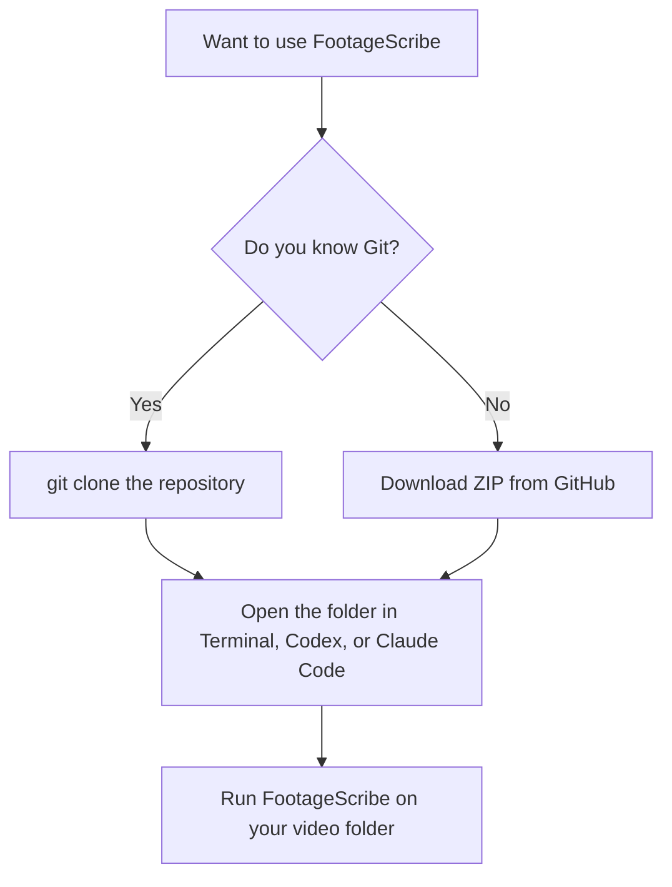

# FootageScribe Beginner Setup

This guide is for people who want to use FootageScribe but are not comfortable with Git, GitHub, command-line setup, or local AI agent workflows yet.

The important point:

You do **not** need to know Git to try FootageScribe.

Git is useful for developers, but it is not the only way to get the project files.

## What FootageScribe Needs

FootageScribe is a local tool. It reads video files from your computer and writes sidecar text files next to them. It can also rename the original files when you explicitly use `--apply-renames`.

It needs:

- A computer with your video files on it
- Python 3.10 or newer
- `ffmpeg`
- `whisper.cpp`
- The FootageScribe project folder

FootageScribe automatically downloads the default Whisper model, `ggml-base.bin`, the first time transcription needs it.

## Do I Need Git?

No.

There are two common ways to get FootageScribe:



## Option 1: Download ZIP

Use this if you do not have Git installed or do not want to use Git.

1. Open the repository page:

   `https://github.com/stariver1119/FootageScribe`

2. Click **Code**.

3. Click **Download ZIP**.

4. Unzip the file.

5. You should now have a folder named something like:

   ```text
   FootageScribe-main/
   ```

6. Open that folder in your terminal, Codex, Claude Code, or another local coding agent.

This works because FootageScribe is just a project folder. Git is not required after the files are downloaded.

## Option 2: Git Clone

Use this if Git is installed.

```bash
git clone https://github.com/stariver1119/FootageScribe.git
cd FootageScribe
```

This gives you the same project folder as the ZIP method, but it is easier to update later.

## What About Codex or Claude Code?

Codex and Claude Code can help you run FootageScribe, but they still need access to the project files.

That means one of these must be true:

- You cloned the repository with Git.
- You downloaded the ZIP and opened the unzipped folder.
- You installed FootageScribe as a Python package.

Git is not strictly required. A downloaded ZIP folder is enough.

## Can an Agent Set It Up for Me?

Usually yes, if the agent can run terminal commands on your computer.

You can paste a request like this into Codex or Claude Code:

```text
I downloaded the FootageScribe ZIP and opened the folder.
Please check whether Python, ffmpeg, and whisper.cpp are installed.
Then run FootageScribe on my video folder without renaming or moving original media.
Use the default base Whisper model and write outputs to _footage_scribe.
```

If you have not downloaded the ZIP yet, use:

```text
Please help me install FootageScribe from https://github.com/stariver1119/FootageScribe.
If Git is not available, use the GitHub ZIP download approach instead.
Do not rename or move any video files.
```

The agent may still need your permission before it installs tools or downloads files.

## Basic macOS Setup

On macOS, the simplest path is Homebrew:

```bash
brew install ffmpeg whisper-cpp
```

Then run FootageScribe from inside the project folder:

```bash
python3 -m footage_scribe.cli --root /path/to/your/videos
```

The first transcription run downloads the default `ggml-base.bin` Whisper model automatically.

## Running Without Installing the Package

If you downloaded or cloned the repository, you can run it directly from the project folder:

```bash
python3 -m footage_scribe.cli --root /path/to/your/videos
```

For Korean footage:

```bash
python3 -m footage_scribe.cli --root /path/to/your/videos --language ko
```

For English footage:

```bash
python3 -m footage_scribe.cli --root /path/to/your/videos --language en
```

## Running After Installing the Package

If FootageScribe has been installed as a Python package, you can use:

```bash
footage-scribe --root /path/to/your/videos
```

## What Gets Created

FootageScribe creates a new output folder:

```text
_footage_scribe/
├── manifest.tsv
├── rename_suggestions.tsv
├── frames/
├── audio/
└── scripts/
    └── 001_example_clip.txt
```

It does **not** rename original video files by default.

It does **not** move original video files by default.

If you want FootageScribe to rename original videos, run it with:

```bash
python3 -m footage_scribe.cli --root /path/to/your/videos --apply-renames
```

Use this only before the files are linked in Premiere Pro, Resolve, Final Cut Pro, or another editing project.

The generated `.txt` files are meant to be easy to paste into an AI agent for editing discussion.

## What If Something Is Missing?

If Python is missing, install Python first.

If `ffmpeg` is missing, FootageScribe cannot read video/audio correctly.

If `whisper.cpp` is missing, FootageScribe cannot run local transcription.

If the Whisper model is missing, FootageScribe downloads the default `base` model automatically unless you pass:

```bash
--no-model-download
```

## Practical Recommendation

For non-developers, the easiest path is:

1. Download the ZIP from GitHub.
2. Unzip it.
3. Open the folder in Codex, Claude Code, or Terminal.
4. Ask the agent to check dependencies.
5. Run:

   ```bash
   python3 -m footage_scribe.cli --root /path/to/your/videos
   ```

Git is helpful, but it should not be a requirement for using FootageScribe.
