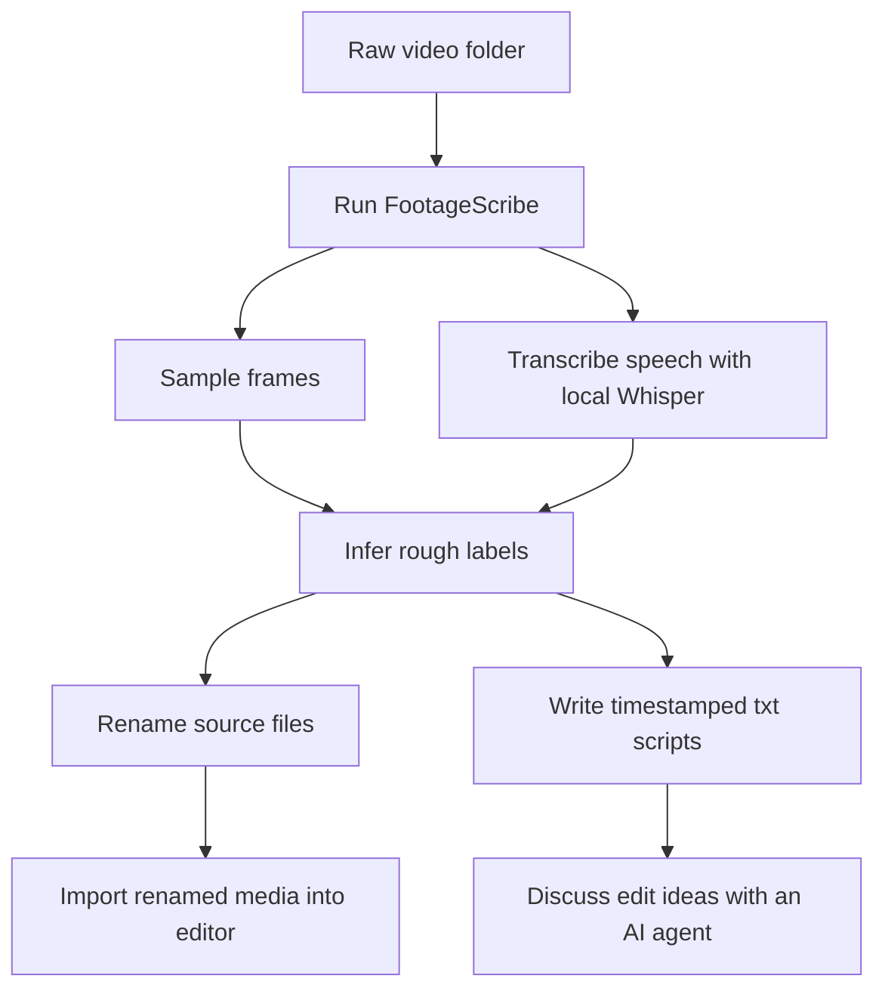

# FootageScribe: A Small Open-Source Tool from Olwaty for Preparing Raw Video Footage

Before a video becomes a finished upload, it usually passes through a messy folder of raw files.

That folder is full of names like:

```text
VID_0017.MP4
IMG_2968.MOV
GX010143.MP4
```

Those names are technically fine, but they are not useful when you are editing. They do not tell you what happened in the clip, who was speaking, whether it was B-roll, whether it was an interview, or whether it belongs near the beginning or end of a video.

The practical fix is simple: rename the footage before importing it into your editor.

The problem is that doing this manually is slow.

So we built **FootageScribe**.

FootageScribe is an open-source CLI that labels raw video files, transcribes speech locally with Whisper, samples representative frames, and can rename source files before they are imported into Premiere Pro, DaVinci Resolve, Final Cut Pro, or another editing tool.

It is provided by [Olwaty](https://olwaty.com).

Olwaty has a main service focused on helping viewers continue watching a creator's content archive. At the same time, we are also building additional practical tools for creators, especially around the parts of the workflow that are still repetitive, fragmented, or hard to discuss with AI agents.

FootageScribe is one of those tools.

## The Default Workflow

FootageScribe is designed to run **before** you import footage into an editing project.

The intended flow is:



A typical command looks like this:

```bash
footage-scribe --root . --apply-renames
```

That command prepares the folder, renames the source files, and writes supporting files under `_footage_scribe/`.

If your media is already linked inside an editing project, you can still run FootageScribe without renaming:

```bash
footage-scribe --root .
```

That safe review mode writes transcripts and rename suggestions, but leaves original filenames unchanged.

## What It Creates

FootageScribe writes a small set of files that are easy for both humans and AI agents to read:

```text
_footage_scribe/
├── manifest.tsv
├── rename_suggestions.tsv
├── frames/
├── audio/
└── scripts/
    ├── 001_market_arrival_walkthrough.txt
    ├── 002_vendor_interview_coffee_notes.txt
    └── 003_product_closeup_broll.txt
```

Each script is a plain `.txt` file:

```text
Original file: GX010143.MP4
Suggested name: vendor_interview_coffee_notes.mp4
Final file: vendor_interview_coffee_notes.mp4
Duration: 00:03:42
Transcription model: whisper.cpp ggml-base
Original modified: yes
Scene label: interview / market stall / product tasting
Confidence: medium

Summary:
Review the transcript and sampled frames, then add a human summary if needed.

Transcript:
[00:00.000 - 00:05.280] We roast these beans a little lighter so the citrus notes stay clear.
[00:05.280 - 00:12.640] The first sip is brighter, but the finish is more chocolate than fruit.
[00:12.640 - 00:18.900] Let me get a close shot of the label and the pour-over setup.
```

This is intentionally boring infrastructure.

The goal is not to replace the editor. The goal is to make the footage easier to find, scan, and discuss.

## Why Text Files Matter

AI agents are much better at helping with editing decisions when they can inspect structured context.

A raw video file alone is not convenient context.

A folder of timestamped `.txt` scripts is.

Once FootageScribe has generated scripts, you can ask an agent:

```text
These are my transcript files from FootageScribe.
Help me identify which clips belong in the intro, which clips are B-roll, and which clips should be skipped.
Do not create a full edit yet. First, give me a rough structure.
```

This keeps the AI discussion grounded in actual footage, not vague memory.

## Local Whisper by Default

FootageScribe uses local `whisper.cpp` models.

The default model is `ggml-base.bin` because it keeps the first run lightweight. If the model is missing, FootageScribe downloads it automatically.

For better transcript quality, you can use:

```bash
footage-scribe --root . --model small --apply-renames
```

For final subtitle-quality work, you may still want a larger model and manual review. FootageScribe is designed for source preparation, not final subtitle publishing.

## Language and Label Rules

FootageScribe is not limited to English or Korean.

Whisper handles transcription language, and FootageScribe uses configurable label rules:

```bash
footage-scribe --root . --language en --rules en --apply-renames
footage-scribe --root . --language ko --rules ko --apply-renames
footage-scribe --root . --rules ./my-label-rules.json --apply-renames
```

That means creators can adapt the labeling behavior to their own language, format, niche, or production style.

## Why Olwaty Is Building This

[Olwaty](https://olwaty.com) is built around a simple creator problem:

Creators do not just need help publishing one video. They need better systems around the whole content lifecycle.

Olwaty's main service helps viewers keep watching a creator's archive instead of dropping off after a single video.

FootageScribe sits earlier in the workflow. It helps creators prepare raw footage before editing, so the material is easier to organize, search, rename, and discuss with an AI agent.

Different stage, same direction:

- FootageScribe helps creators structure raw footage before editing.
- Olwaty helps viewers continue through finished creator archives.
- Both are about making creator content easier to navigate.

We expect to keep building more of these creator-focused tools around the main Olwaty service.

Some will be small. Some will be open source. Some will be internal workflow experiments that later become public.

The common thread is practical: reduce the repetitive work around creator content so creators can spend more time making and shaping the actual work.

## Try It

Repository:

```text
https://github.com/stariver1119/FootageScribe
```

Basic use:

```bash
footage-scribe --root . --apply-renames
```

Safe review mode:

```bash
footage-scribe --root .
```

If you are new to Git or local agent setup, the repository includes a beginner setup guide that explains how to download the project as a ZIP and run it without knowing Git.

FootageScribe is early, practical, and intentionally small.

That is the point.
